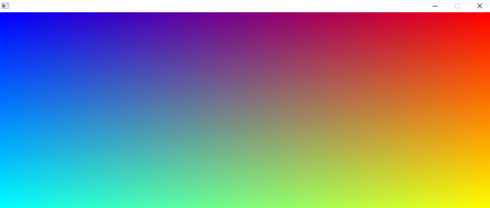

# fast-buffer-display-template
Template application using sdl to blit an rgb array to the screen. Example usage to draw onto buffer.
```cpp
for (int x = 0; x < SCREEN_WIDTH; x++) {
    for (int y = 0; y < SCREEN_HEIGHT; y++) {
        frameBuffer[y][x].red = 255 * (float) x / SCREEN_WIDTH;
        frameBuffer[y][x].blue = 255 * (float) (SCREEN_WIDTH - x) / SCREEN_WIDTH;
        frameBuffer[y][x].green = 255 * (float) (y) / SCREEN_HEIGHT;
    }
}
```
Produces fully responsive window.

